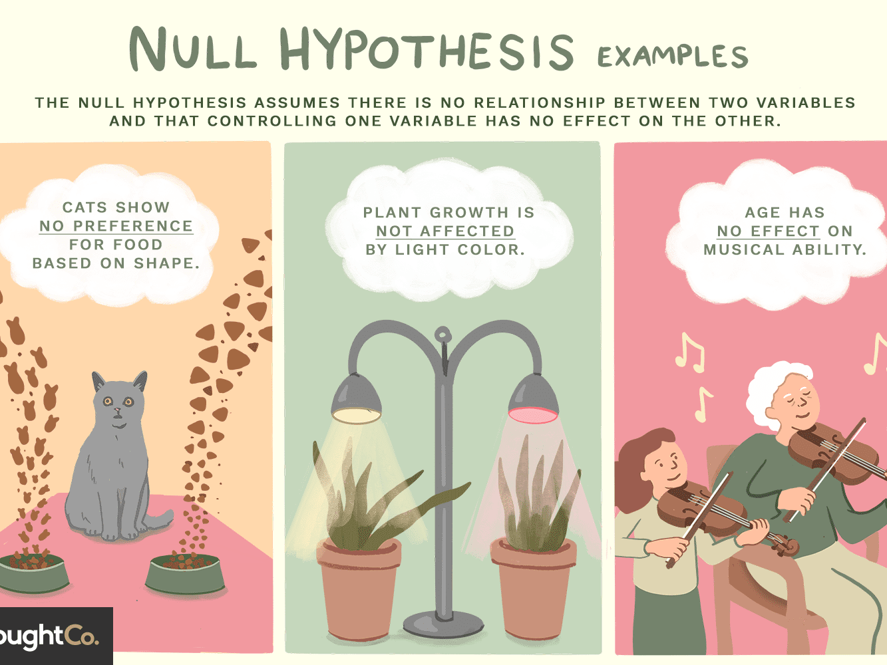
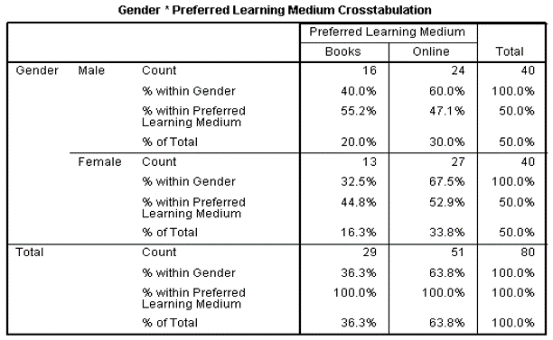
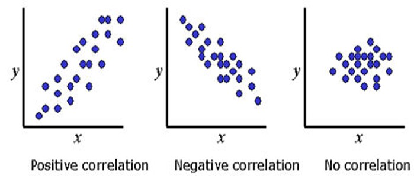
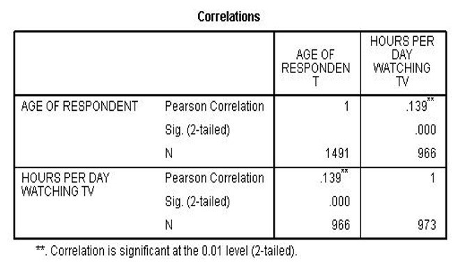
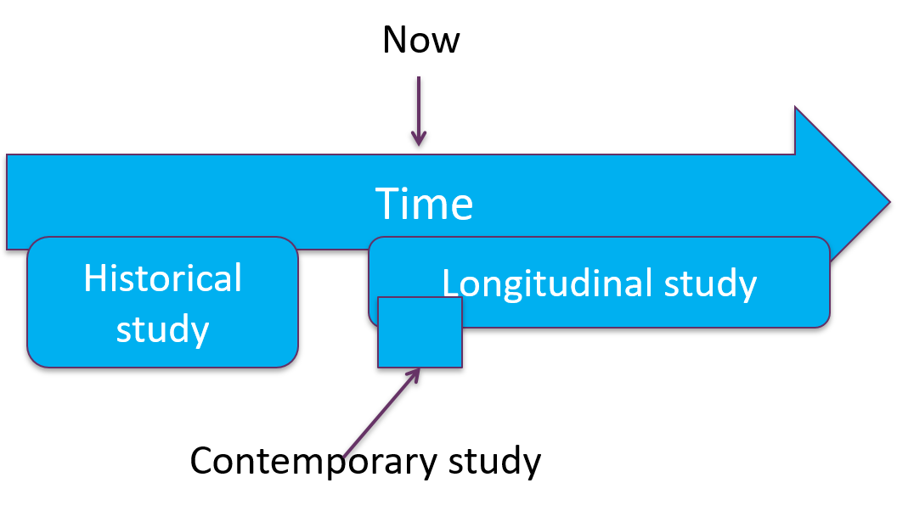
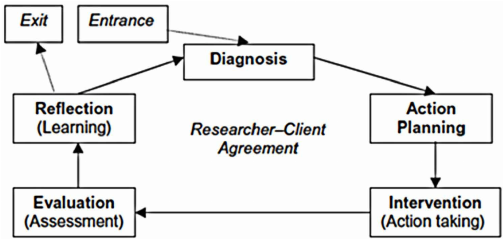
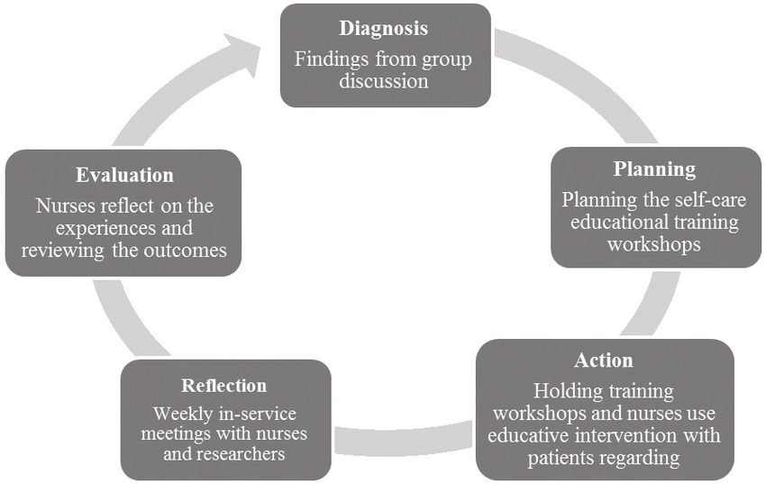

# Intro to ICT Research Exam Revision

## Topics
1. [What is ICT Research?](#topic-1-:-what-is-ict-research?)
2. [Introduction to Project Management](#topic-2-:-introduction-to-project-management)
3. [Literature Review](#topic-3-:-Literature-Review)
4. [Scientific Investigation](#Topic-4-:-Scientific-Investigation)
5. [Ethical Considerations in ICT Research](#Topic-5-:-Ethical-Considerations-in-ICT-Research)
6. [Monitoring & Controlling Project Deliverables](#Topic-6-:-Monitoring-&-Controlling-Project-Deliverables)
7. [Conducting Survey Research](#Topic-7-:-Conducting-Survey-Research)
8. [Conducting ICT Experiments](#Topic-8-:-Conducting-ICT-Experiments)
9. [Data Analysis](#Topic-9-:-Data-Analysis)
10. [Creating ICT Artefacts as Part of Research](#Topic-10-:-Creating-ICT-Artefacts-as-Part-of-Research)
11. [Case study research and action research](#Topic-11-:-Case-study-research-and-action-research)

## Tutorials
* ~~tutorial 1~~
* ~~tutorial 2~~
* [tutorial 3](https://kaplanint-my.sharepoint.com/:w:/g/personal/elam_apac_kaplaninc_com/EWiKHqRKqklFvupllKW_s10Bv9-UIXDCSOBXUHNqNAV0zQ?rtime=Z3hxBrb810g)
* [tutorial 4](https://kaplanint-my.sharepoint.com/:x:/g/personal/elam_apac_kaplaninc_com/EZvbVKqID8pNpVRpPfcnQR4BDTHXSlxsmvNFoY6g7NF0CQ?e=4EITac)
* [tutorial 5](https://kaplanint-my.sharepoint.com/:w:/g/personal/elam_apac_kaplaninc_com/EZVi6ZjxuZlIm4OVj_E3-iUBuMF1PUhMMANneqgzhf958w?rtime=hGAVXbMH2Eg)
* ~~tutorial 6~~
* [tutorial 7](https://bit.ly/30Ee1dO)
* ~~tutorial 8 pt 1~~, [tutorial 8 pt 2](https://bit.ly/3cZki6c)
* [tutorial 9](bit.ly/2AdkCkB)
* [tutorial 10](https://kaplanint-my.sharepoint.com/:x:/g/personal/elam_apac_kaplaninc_com/EW5CWtF_xXFKpfJXfAdPubEBohnTFimNlpwRs9i7tVjxFA?rtime=JW0C37Uo2Eg)
* ~~tutorial 11~~

___

### **Topic 1** : What is ICT Research?
***tags**: research definition, types of research, research project phases, research approaches*
### learning outcomes
* what is research?
* what types of research occurs in ict?
* what is a project? what is a research project?
* what are usually the main stages in a research project?
* what are these research approaches?

**what is `research`?** - *it is the creation of new knowledge, using an appropriate process.
> the definition of research are generally to do with observing and describing, predicting and determining causes.*
>> in simpler terms, the goals of scientific research are to examine a sample demographic for the occurrence/non-occurrence of a phenomenon with the interest of generating new knowledge; knowledge which from scientific purposes has reliability and validity

**scientific or academic research** - *an investigation on the basic principles and reasons for occurence of a particular event or process or phenomenon. Also known as theoretical research. Note that a research does not concern with solving any practical problems of immediate interest. It basically provides a systematic and deep insight into a problem and facilitates extraction of scientific and logical explanation and clusion on the topic.*  
>>academic research is about finidng out something that is not already known. A research must be novel, verifiable, repeatable and reported in a certain way.

**aims of research**
* observing and describing
* predicting
* determining causes

**outcomes of a research**
* a new or improved product
* a new or modified model or theory
* a new or improved technique
* more understanding of a particular topic

**types or categories of research**
* exploratory research - *To get a better understanding, test the feasibility or determine the best method to be used in a subsequent study. Main objective is to identify key issues and key variables.*
> finding out when little is known. beinging of a new research area.
* descriptive research - *To study on something new or something that people are not aware about. It is directed towards answering questions such as what is this? e.g. what is covid19?*
> creating a picture of what is going on without explaining why.
* explanatory research - *To understand or to explain relationships between targeted variables. Often uses correlations to study relationships between characteristics off individuals, groups, situations or events.*
> understanding the cause and effect of things.

**ict research** - *the creation of new knowledge in any area of ICT where the goal is the creation of new knowledge*

**project** vs **research Project** - *it is a temporary sequence of unique and connected activites having one goal or purpose and that must be completed by a specific time, within budget, and according to specification.*
> *A research project is a project where the goal or purpose is to **create new knowledge***

**research project phases** ***be prepared to describe each phase..*
* `read relevant literature` - *gather ideas, understand the topic or problem, finding out what is already known*
* `define research problem` - *define research question or problem statement, variables involved (`independent/dependent`), `hypotheses`, `theories` and `models`. if there are no specific questions, you should then define your research aim or objective clearly.*
* `design research` - *determine how the aims can be achieved and research questions answered, choosing a research strategy or approach to determine how we generate data for analysis*
* `collect data` - *depending on which approach or strategy was used, the data will be collected based on it*
* `analyse data` - *depending on the type of data that was collected, either quantitative or qualitative, testing of hypotheses*
* `report findings` - *present findings and conclusions*

**types of research approaches**
* survey - *collects the same data from a large group of people*
    > collecting and analysing data to identify patterns and trends
    * data can be `quantitative` or `qualitative`
    * data collection must be designed and administered to minimise bias so that data can be effectively analysed
    * used frequently in information systems
    * some examples include unit surveys, market research
* experiment - *designed to find relationships between selected variables in an environment*
    > finding the relationship of selected variables in a controlled environment
    * either a laboratory-based or field experiments
    * some examples include human computer interface (HCI) studies, system performance comparisons, pair-programming vs solo etc
* design and creation - *focuses on developing new products*
    > developing a new ict product, model, or method
    * products can be a system or it can be a development process, method or model
    * some examples includes intelligent systems, network protocols, development methodologies
* case study - *focuses on one or a few instances of an interest*
    > indepth studing on one or a few instances
    * cases can be anything from organisations, systems, projects, events
    * studies in depth using multiple methods of data collection
    * some examples include reasons for user resistance to new type of system, problems with system development methodologies
* action research - *focuses on practical issues or fact findings to improve the quality of action*
    > producting both practical outcomes and research outcomes
    * it has both `practical outcomes` as well as `research outcomes` (2 outcomes)
    * it is similar to case study approach except that it involves the active contribution of the researcher to the situation being studied.
    * some examples include improving employees' compliance with security policies, improving business processing via introduction of tablets

additional materials
* [Understanding Research](https://www.etu.org.za/toolbox/docs/development/research.html)
* [Definition of Research](https://www.westernsydney.edu.au/research/researchers/preparing_a_grant_application/dest_definition_of_research)
* [Research Wiki](https://simple.wikipedia.org/wiki/Research#:~:text=Research%20is%20the%20process%20of,facts%20in%20an%20organised%20way.&text=Research%20is%20done%20by%20applying,trying%20to%20better%20explain%20observations.)

___

### **Topic 2** : Introduction to Project Management
***tags**: project tools, process groups*
### learning outcomes
* what is project management?
* why is project management so important?
* what is PMBOK and what are the knowledge areas it contains?
* what are the project management process groups?
* ~~can you create a scope statement?~~
* ~~can you use microsoft project to develop a gantt chart?~~

> **what is a `project`?**  
> *It is a temporary endeavor undertaken to create a unique product, service, or result.*  
> *`Characteristics` of a project includes unique purpose, temporary, requires resources, involves uncertainty or risk and has a deliverable.*
>> [project characteristics example](https://opentextbc.ca/projectmanagement/chapter/chapter-2-what-is-a-project-project-management/)

> **what is `project management`?**
> *Applies knowledge, skills, tools and techniques to manage activities and processes to improve project outcomes.*  
> *The key to project `success` is to deliver the project within time constraints, budget, and according to specification.*

**why do you need project management?** - *Supports the project team in answering questions like..*  
* what tasks must be performed? in what order to produce the deliverable of the project?
* when should each task be performed?
* who will completed the task?
* what resources are required?
* how much time is available or required for a task?
* what is the best way to communicate project details to those with an interest in the project? (e.g. stakeholders)

**tools and techniques**
* project charters, scope statements and stakeholder matrix
* work breakdown structure (WBS), gantt chart, network diagrams
* cost estimates and human resource plans

> **what is `PMBOK`?**  
> *Provides a base of standards, procedures and best practices for managing all types of projects and is used by many organisations to apply project management principles to projects.*

**`PMBOK` knowledge areas**
1. scope statement
2. time management
3. cost management
4. quality management
5. human resource management
6. communications management
7. risk management
8. procurement management
9. stakeholder management
10. integration management

**`project management` process groups** - *a logical grouping of project management inputs, tools,  techniques and outputs*
1. initiating
    * establishes the project scope with stakeholders and identify constraints e.g. project charter
    * scope - *boundaries of the project*
    * constraints - *trade off between scope, cost, time and quality*
        * scope - how much you can actually do with the time available
        * cost - how much you can afford to spend
        * how - much time you got to deliver it
        * quality - the level of quality of the deliverable
2. planning
    * purpose is to guide the execution of the project
    * includes processes from every knowledge area e.g. planning schedules, resources, costs, human resources etc
    * outputs from this phase include 
        * `scope statement` - a document used to develop a common understanding between stakeholders which includes the project justification (why?), brief description of the requirements and deliverables, project success criteria, assumptions and constraints.
        * `work breakdown structure (wbs)` - a hierarchical grouping of work or task involved in a project in order to deliver the project.
        * scheduling - shows the durations and interdependencies of each task e.g. the start or completetion of an individual task may depend on the start or completion of another task.
            * `gantt chart` - a simple horizontal bar chart that depicts project tasks against a calendar
            * `network diagram` -  a graphical network model that depicts a projects tasks and relationship between those tasks
3. executing
    * involves managing and performing the work descried in the project plan
    * a `milestone report` can keep the focus on completing major milestones
4. monitoring and controlling
    * involves measuring progress towards the project objectives, monitoring deviation from the plan, and taking corrective actions to match progress with the plan.
    * this is needed during all phases of the project
    * output includes `performance reports`, requested changes and updates to various plans
    * `baseline` - the approved project management plan plus approved changes
    * this can be done using the `tracking gantt` from microsoft projects
5. closing
    * in order to close a project, we must finalised all activities and transfer the completed or cancelled work to the appropriate people.
        * involves gaining stakeholder and customer acceptance of the final product or services.
        * if project is not completed, there should be a formal closure in order to reflect on what can be learned from the past and to improve on future projects.
        * output includes `project archives` and `lessons learned report`
        * most projects will include a final report or a presentation

>**sample question**  
>*“A project’s schedule depends only on the project’s task durations”. Do you agree or disagree with this statement? Explain your response.*  
>I `disagree` with this statement because a project has a planned schedule or a deadline to deliver the output and the list of tasks will then be allocated based on the available time and resources given to the project. However, it is also true that the actual duration can be affected by the actual task completion date and time, as a result the project also somehow relies on the task durations.

___

### **Topic 3** : Literature Review
***tags**: literature review, research structure*
### learning outcomes
* what are the objectives of a literature review
* ~~can you find and obtain relevant published literature?~~
* ~~can you cite references using IEEE and APA styles?~~
* what are the main types of information that a write up of a research project should include?
* how do the goals of oral presentations and written reports of research differ?

**`recap`: project research phases** -> *read relevant literature*

> **what is a `literature review`?**
> *a critical anlaysis of published sources or literatures of a topic. the output of the review should describe, summarise, synthesise and evaluate the featured literatures.*

>**purpose of `literature review`**  
> *useful to gather knowledge about a topic, specifically to find out what has been research. it can be help to develop a broad conceptual context into a research.*

**steps to conduct during a lit review**
* search for literatures
* obtain materials (hard/soft)
* assess the credibility
* read and understand
* critically evaluate the quality
* record the bibliographic details
> **literature review as standalone**
> *enables others to understand the field, point to strengths, weaknesses, omissions or bias in the previous work, point to gaps that have not previously been identified or addressed.*  
> **literature review in research paper**
> *establish the need for a research, place the researcher's work in the context of what has already been published, introduce the theories, relevant methodologies or strategies that will be used in the research.*

**structure of research papers**
* beginning - *title, author, abstract, keywords*
* middle - *introduction, lit review, research methodology, results, discussion which includes limitations, implications, future research.*
* end - *references, appendices*

___

### **Topic 4** : Scientific Investigation
***tags**: independent/dependent variables, hypothesis*
### learning outcomes
* what is explanatory research?
* what is a variable?
* how to independent and dependent variables differ?
* what is a hypothesis?
* what is a theory?
* what is a model?
* can you generat a hypothesis based on a research question?  

### `extended` learning for exams
* create a research question
* create a hypothesis
* identify iv and dv

**`recap`: project research phases** -> *define research problem*

**`research question` / aka rq**  

**some examples:**
* what factors influence a user's security behaviour?
* why are users susceptible to phishing attacks?
* if there aren't any explicit rq, a clear research `aim` or `objective` should be established.
    * to find an effective way to train people to identify and avoid phishing web sites.
    * `aim` - *what are you going to do*
    * `objective` - *so that you can fulfil that*
* *prepare more examples for exam..*

**explanatory research** - *trying to establish cause and effect*

may include:
* `variables` - *can be any value that varies (e.g. quantity or quality)*
    * `dependent` variables - *the variable that a researcher is interested in.*
        * changes as a result from the change on iv (`effect`)
    * `independent` variables - *the variable that is believed to affect the dependent variable.*
        * changes one or more dv (`cause`)
    * operational definitions such as processor speed (mghz) or weight (mg/g/kg)
* `hypotheses` - *a statement about the relationship between the iv and dv*
    * the relationship in a hypothesis specifies how the value of one variable changes in relation to another.
        >* *the relationship may be positive or negative or the variables may have no relationship to one another (aka null hypotheses h0)*
        >
        > an example:
        > 
        > [image source](https://www.thoughtco.com/null-hypothesis-examples-609097)
    * some examples:
        * *h1 - `system quality` positively affects `user satisfaction` with the system*
            * iv - system quality
            * dv - user satisfaction
        * *h2 - the perceived threat severity of an outdated browser will influence a user's intention to update the browser*
    * ***`note: hypotheses are usually derived from, and justified by the literature that has been reviewd.`***
    * types of hypotheses
        * `null` - *there are no gender differences in levels of internet use*
        * `non-directional` - *there are gender differences in levels of internet use*
        * `directional` - *males have higher levels of internet use than females*
            * which is the iv and dv?
* `theories` - *an interrelated set of statements of relationship whose purpose is to explain and predict* 
* `models` - *represents a situation or system and it is used to help understand it (framework?)*
    * some [examples](https://is.theorizeit.org/wiki/Main_Page) for theories and models

> **sample question 1**  
> The Internet of Things (IoT) provides huge potential benefits, yet has privacy and security issues. You are interested in how potential users’ perceptions of the risks influence their intentions to acquire IoT devices.  
>
> Identify a research question and hypothesis for a research study you might undertake to investigate one aspect of this issue. Label the independent variable and the dependent variable in your hypothesis.

## **Topic 5** : Ethical Considerations in ICT Research
### learning outcomes
* benefits and harsm of each course of action
* best overall consequences
* moral rights of all affected parties
* treat everyone equally
* develop moral virtues
* demonstrate compassionte care

there were no slides..

## **Topic 6** : Monitoring & Controlling Project Deliverables
***tags**: monitoring and quality control*
### learning outcomes
* why must projects be monitored and controlled?
* what are the key monitoring and controlling processes?
* can you use gantt charts and network diagrams to monitor projects?
* can you describe the common tools used for quality management?

> **why monitor and control is important?**  
> *(1) to ensure that the project is meeting its objectives and addressing the problem/opportunities/directives that the project was initiated/started to deal with. (2) checking the progress of the project and take corrective actions when necessary.*

**recap: reasons why a project fail**
* only project team is interested in the end result
* no one is in charge
* insufficient resources
* project not tracking against the plan
* no communication
* project stays from original goal

**5 project management process group**
1. initiating
2. planning
3. execution
4. `monitoring and controlling` - *involves measuring the progression towards project goal while monitoring deviation and taking correct actions.* (topic 2 repeated)
    * **outputs** include performance reports and changes or updates to the actual plan. schedule can be monitored using `tracking gantt`.
    * **`baseline`** - an approved project management plan with approved changes.
    * list of **work/processes** in this phase includes:
        * **monitoring and controlling project work** - *collect and disseminate performance information and use the collected information to forecast where the corrective action might be required.*
            * outputs include recommended corrective and preventive actions, forecasts, requested changes
        * **integrated change control** - *ensures that changes are managed across the project knowledge areas.*
            * outputs include approved and rejected change requests, any updates to the project plan such as scope or requirements, approved corrective and preventive actions.
        * **scope verification** - *ensures that project deliverables are formally accepted.*
        * scope control - *ensures that changes to project scope are controlled.*
            * `control` and `verification `involve updates to the project plan and specification documentation.
        * **schedule control** - *monitors and control changes to project schedule.*
            * outputs include updates to project plan, requested changes and recommended corrective actions.
                * tools: tracking gantt and network diagrams
                * monitoring critical path and slack time:
                    * critical path - the sequence of dependent tasks which determines the earliest possible complettion date of the project. tasks on the critical path cannot be delayed without delaying the entire project schedule.
                    * slack time - the amount of delay that can be tolerated between any non-critical task without causing a delay to the completion date of the project.
        * **cost control** - *monitors and control costs and changes to the project budget.*
            * outputs inlude estimated cost updates, requested changes, recommended corrective actions.
            * updates to the project management plan
        * **qualtiy control performance** - *measure the results of the project to check if it has met the quality standards.*
            * outputs include quality control measures, recommended corrective and preventive actions, requsted changes, updates to project plan.
                * tools: cause-effect diagram (ishikawa), run chart, control chart, scatter diagrams, histograms, pareto chart and flowchart.
        * **managing the project team resouces** - *tracks team's performance, provide feedback, resolve issues and coordinate changes.*
        * **managing the stakeholders** - *manages stakeholder communications and work with stakeholders to ensure that requirements are met and issues are resolved.*
            * outputs include status report, resolved issues, approved corrective actions, updates to project plan.
5. closing

*try to explain each process group with examples.*

## **Topic 7** : Conducting Survey Research
***tags**: survey research, approaches to collect data, sampling size/frame, pre-test and pilot-test*
### learning outcomes
* what is survey research?
* what are the main approaches used to collect data in survey research?
* how does a research sample differ from a target population?
* what is a sampling frame?
* why are pre-testing and pilot testing used?
* how do probability and non-probability sampling techniques differ?
* what are the advantages of survey research?
* what are the disadvantages of survey research?

> *A `survey` is about finding perception, it tells you what is going on, not telling you why.*

**`recap`: project research phases** -> *design research & collect data*

**design research** - after the research question or problem has been specified, we will determine how the aims will be achieved and have the research questions answered.

**types of research strategy or approach:**
* survey
* design and creation
* experiment
* case study
* action research

**survey** - obtaining the same kinds of data from a large group of entitiles, people or events in a systematic way.

**there are serveral ways to generate data using survey such as:**
* quantitative
    * questionnaires
    * interviews
* qualitative
    * observation
    * document analysis

**steps for planning a survey research**
* decide on data requirements - *what data will be needed to answer the research questions?*
* decide on data generation method - *questionnaires/interviews/observation/document analysis*
* obtain `sampling frame`
* determine `sampling technique`
* design data collection instruments

**questionnaires** - printed/online questionnaires or face-to-face/telephone interviews

**designing questionnaires**
* form of administration - *self-administered or researcher-administered*
* list or type of questions
    * open questions or close questions
    * types of scale (yes/no, quantity, agree/disagree)
* layout and structure - *explain purpose, how to complete and return*

**3 key terms:**
1. population of interest - *the groupd that you want to generalise your study to.*
    * trying to find out the voters of singapore citizens
    * whole population of singapore is 5 mil, this is the population of interest.
2. sampling frame - *the list from which sample will be drawn upon. this should contain the whole population of interest*
    * for statically study, choosing a sampling size
    * find a list of people that you can get in touch to do my study
3. sample - *the actual size that you are collecting data from.*
    * picking the sample size from sampling (sub set of sampling size e.g sampling frame=1000 sample=500) size should be smaller than or equal to sampling frame.

**sampling techniques**
* `probability sampling techniques` - *every element in the population has a known non-zero probability of selection.*
    * random sampling - *samples are randomly selected from population of interest. every item in the population has the same probability of being in the sample.*
    * variations - *random selection at some point*
        * systematic sampling - *getting a sample by intervals*
        > the randomness is the order of the list and  the number that you pick
        * stratified sampling - *getting a sample by profiles*
        > the key is to strike a balance in profile e.g. forming a team by major of students
        * cluster sampling - *getting subset of whole population*
        > e.g. height of all singapore citizens in areas of singapore (e.g. woodlands, jurong etc.)  
        > e.g. find the sample using generalisation by an area
* `non-probability sampling techniques` - *probability of any member of the population being chosen is unknown*
    * purposive sampling - *deliberately hand-pick samples*
    > e.g. someone of this profile to be part of my study or not you will but by change you will be.
    * snowball sampling - *find one person from the target population, then ask for recommendations on potential candidates that are relevant to the research.*
    > dead end is when someone who refuse to give you contact
    * convenience sampling - *researchers simply select respondents who are convenient for them (e.g. easy to reach or willing to help)*
    > e.g. i am a tutor who has access to students of my class

>**sampling size** - actual sample size is also influenced by response rate.

**testing before collecting of data** - *to check if the question is easy or hard to understand?*
* pre-test - group of potential respondents to identify any problems with questions
* pilot-test - trail all procedures and instruments to ensure test is ready for study

**advantages of survey research**
* can provide a wide coverage
* affortable and cheaper than other approaches
* collects data faster than other approaches
* studies can be replicated relatively easily as measurements can be reused
* can determine the relationships between the variables

**disadvantages of survey research**
* results may lack depth
* may be an overemphasis on what can be counted and measured quantitatively
* snapshot of points in time (e.g. the time that the survey was taken may influence the results)
* does not establish cause and effect
* does not provide as rich description of a situation as case study research

## **Topic 8** : Conducting ICT Experiments
***tags**: experiments, causality, correlation, random sampling, random allocation, validity (internal/external)*
### learning outcomes
* what is an experiment?
* why would a control group be used in an experiment?
* why is it good to randomly allocate participants to experiment groups?
* what is the difference between a true experiment and a quasi-experiment?
* what is an experimental design?
* what is the main advantage of experimentation as a research strategy?
* what decisions need to be made when designing an experiment?
* wat are internal and external validity?

> **what is an experiment** - *involves observation undert controlled conditions to test a `hypothesis`. it is one of the research strategies that investigates `cause and effect` of the relationship, also known as cauality, between variables namely, independent and dependent.
> 
> *all factors that may affect the results except factors that are hypothesised are excluded or controlled.*
> objective of experiment - *to manipulate the `independent` variable(s) to observe changes in the `dependent` variable while controlling other factors.*

**recap `hypotheses`** - *a statement about the relationships between variables.*

**causality vs correlation**
* `correlation` - *when there is a relationship between two variables*
    * e.g. when this increase, that increase
* `causality` - *when the change in one variable is the *cause* of a change in another variable*
    * e.g. when this change, this will change that

> **quick questions**  
> which of the following hypotheses express a causal relationship?  
> * h1: level of use is associated with user satisfaction with a system  
> * h2: pair programming improves program quality
> * h3: users who receive password memorisation training will create stronger passwords  
> * h4:	users who believe they are vulnerable to security threats are more likely to believe that  threats will be severe  
> ans: h1,h2,h3

**why researchers prefer using experiments to answer research questions?**

here are some of the characteristics of an experiment:
* precise observations and measurements
* proving or disproving hypotheses
* identification of causal factors e.g. one direction links
* explanation and prediction
* repetition

**purpose of controlling variables and the environment** - *isolate the elements from other variables so that there is no interference and no disruption to the experiment.*
* eliminate the factor via exclusion criteria
* hold the factor constant via inclusion criteria (if you cannot eliminate it)
* use random selection or allocation
* use a control group - *the difference from treatment group is the change in independent variable*

**random sampling vs random allocation**
* random sampling - *samples that are randomly picked from the population of interest which also tells us that each item in the population has the same probability of being in the sample.*
* random allocation - *allocation to experimental groups from the whole sample is random*
    * `usually random sampling is done first then followed up random allocation`

> **benefits of random sampling or allocation**
> *Random assignment of participants helps to ensure that any differences between and within the groups are not systematic at the outset of the experiment. Thus, any differences between groups recorded at the end of the experiment can be more confidently attributed to the experimental procedures or treatment.* [*Source*](https://en.wikipedia.org/wiki/Random_assignment)

> **importance of random sampling**
> *Random assignment ensures that participants in a cause and effect study are unbiased as it prevents people’s history from causing an extraneous variable within the experiment.* [*Source*](https://dunekahnshillan.wordpress.com/2011/10/06/the-importance-of-random-assignment-in-creating-experiments/)

**validity** - *measuring what the researchers set out to measure.*
* internal - 
    * threats
        * differences between the experimental and control group
        * historical events
        * maturation - *impact of time as a variable in a study*
        * instrumentation
        * experimental mortality
        * reactivity and experimental effects
* external -  
    * threats
        * using samples that are not representative of the population
        * insufficient participants
        * non-representative test cases

**types of experiment (not tested)**
* true experiment vs field experiment
    * true = lab = controlled environment = unrealistic settings
    * field = lesser control = realistic settings = results can be influence by external factors
* experimental design - *the way in which the experiment was designed. e.g. use of randomisation? use of control groups? number of experimental groups or pretesting of participants etc.*
    * true or lab experiments - *high control but possibly unrealistic settings*
    * quasi-experiments aka field experiments - *more realistic setting but lesser control due to the external factors that may influence the experiment result*

**conditions to prove causality**
* correlation - relationship between independent and dependent variable
* time order - cause precedes effect in time (values of iv change then values of dv change). the cause and effect is after the treatment (e.g. fever, take medicine and temperature cools down)
* rule out other possible explanations (only the two variables causes the effect, no other elements factors in which is why it is a controlled experiment)

**steps for designing and conducting an experiment**
1. select relevant variables
2. specify levels of treatment
3. ensure control of experimental environment
4. choose the experimental design
5. select and assign participants
6. pilot test, revise, test - pretesting of procedures as well as instruments
7. analyse data

**advantages & disadvantages of experiment**
* advantages
    * well established method
    * only way to demonstrate cause-effect relationship
    * able to repeat experiments and extend results across people, time and situations.
* disadvantages
    * artificiality - limits the ability to generalise
    * impossible to control all parameters
    * difficult to recruit representative samples

additional materials:  
* [8 Main Advantages and Disadvantages of Experimental Research](https://greengarageblog.org/8-main-advantages-and-disadvantages-of-experimental-research)

* the `aim` of experimental research is to predict phenomenons
* this is where a researcher manipulates one variable and controls or randomizers the rest of the variables
* advantages
    * able to control variables
    * determining cause and effect relationship is easy
    * provides better results
* disadvantages
    * creates artifical situations e.g. controlling irrelevant variables in which creates a situation that is artificial

## **Topic 9** : Data Analysis
***tags**: qualitative/quantitative analysis, types of test (chi-square/correlation/t-test), inferrential/descriptive statistics*
### learning outcomes
* What is the difference between quantitative and qualitative data analysis?
* Give an example of each type of quantitative data: normal, ordinal, interval and ratio
* What are the common descriptive statistics?
* What is the difference between descriptive and inferential statistics?
* What does it mean to test a hypothesis using statistics?
* Desribe the different types of tests: chi-square, correlation and t-test
* What are the advantages and disadvantages of qualitative analysis?

**`recap`: Project research phases** -> *Analyse data*

> *Having clarified that the research problem to be addressed with:*  
> * Address aims/RQs/theories/models/hypotheses  
> * Determine how the aims will be achieved and research questions answered

**What is data analysis?** - *The process of using the data you have collected to answer your research questions*
* Quantitative - *focus on numerical data (numbers) (`descriptive/inferential`)*
    * `Nominal` data that describes categories, analysis involves counting and comapring frequencies or figures. 
        * e.g. approximately 80% of mobile phones in australia are android and 20% are ios
    * `Ordinal` data is measured on scale with order
        * e.g. student grades or scales in questions (strongly disagree to strongly agree)
    * `Interval` data is similar to `ordinal`, difference is between points of the scale
        * e.g. temperature in degrees celsius or time on 12 hour clock
    * `Ratio` data is similar to `interval` but there is a true zero point to the scale
        * e.g. age in years or temperature in degrees kelvin
* Qualitative - *focus on non-numerical data (text or other media such as interview recordings, company documents, websites or developer's model)*
    * `commonly` generated for interview data, case studies and action research
    * `objective` is abstracting themes and patterns that are relevant to the research topic or question
    * analysing textual data
        * data preparation
        * analysis
            * categorise according to `themes`, catogories can be deductive (based on existing theories) or inductive (based on the collected data)
        * draw conclusion

**Descriptive statistics** - *used to describe and summarise information about the sample*  
* Graphical descrpition methods
    * pie charts
    * bar charts
    * line charts
    * box plots
* Numerical descriptive methods
    * measures of central tendency
        * mean - average
        * median - center value if all are listed in increasing order
        * mode - most frequent value
    * measures of variability
        * range - difference between maximum and minimum value
        * quartiles - top 25%, next 25% etc
        * standard deviation - average distance of each value from the mean

**Inferential statistics** - *used to make predictions or inferences about the population characteristics from the information contained in a sample*  
* Chi-square - *used to test for differences between the observed distribution of data among categories and the expected distribution (based upon null hypothesis)*
    * e.g. are males more likely than females to own a Raspberry Pi?
        * Gender preference for learning
        Pearson Chi-Square = 0.474, p = 0.485

        
* Correlation - *used to measure how variables or rank orders are related*
    * r - *represents strength and direction of relationship (-1 to 1)*
    * p - *represents probability that the relationship is significant (sig. in SPSS)*
        * e.g. how is age related to TV watching?  

          
        
* T-test - *used to compare whether the mean of a single variable differs from a specified constant*
    * means for 2 group - user satisfaction under 25 vs 25 and over
    * means of 2 variables for a single group - before and after

> ***When testing a hypothesis**, you accept or reject the hypothesis based on the information from the samples. So any sample will vary somewhat from its population, you must have a way of judging whether these differences are statistically significant or insignificant.*

> Example:  
> H1 - Users who receive training on how to remember passwords will create stronger passwords  
> H0 - Users who receive training on how to remember passwords will not create stronger passwords (null hypothesis)  
> If you find that passwords from the treatment group are stronger than those from the control group, how likely is it that the same would be true for the population?  
>
> **A common convention is to say that if the probability of the difference occurring by chance is less than 5% (p<=0.05) you can accept that the difference is ‘real’ or significant.**

**advantages and disadvantages of qualitative**
    * advantages
        * close involvement of researcher in the situation under study facilitates insight
        * research situation provides flexibility in data collection
    * disadvantages
        * hard to generalise because of small number of cases
        * due to richness, data is usually open to variety of interpretations
        * lack of accepted techniques for analysis

## **Topic 10** : Creating ICT Artefacts as Part of Research
***tags**: ict artefacts, proof of concept, design and creation research, *
### learning outcomes
* name the 4 kinds of ict products that might be designed as part of an ict research?
* how does design and creation research differ from system development?
* what does `proof of concept` mean in the context of ict research
* what criteria can be used when evaluating design and creation research?
wat issues can be associated with the role of clients in desig and creation research?

**`recap`: project research phases** -> *design research & collect data*

**types of artefacts**
* constructs - *concepts or vocabulary used in a particular it related domain (entities, object orientation etc.)*
* models - *represent a situation and aid understanding and solution development (osi model etc.)*
* methods - *approaches to solving problems (algorithms, system development methodologies etc.)*
* instantiations - *working systems that demonstrate implementations in a system (aka as prototype or proof of concept)*

**examples of ict design and creation research**
1. ict can be the main focus of the research - e.g. a new technology or adpation for a new domain
2. ict can be a vehicle for something else - e.g. developed to allow comparison of two algorithms
3. the focus can be on the process of technology used or system development - e.g. new development approach where the system developed isnt the new contribution to knowledge
    * design and creation might be the only approach to ict research if not, it can be combine with another type of research such as experimental research

**proof of concept** - when ict instantiations are developed, oftenly, the researchers do not evaluate whether they would work in a real world context - a prototype is usually sufficient
* `objective` - to show that something is possible aka `proof of concept` or `proof by demonstration`

> *artefact is used for restricted task that may not scale up to a typical industry task  
>
> *artefact is tested by students or a small group of potential users, not *real* users

**evaluation of design and creation research** - things to consider:
* what kind of it artefact is created?
* what differentiates the work from normal design and development work?
* is there enough information given about the development methology?
* do the researchers describe their use of any data generation methods?
* is enough evaluation information provided?
* do the researchers use their results to make generalisations? is this appropriate?
* what limitations in their design and creation strategy do the researchers recognise?

**clients** - provide funding and improve relevance but can be a conflict between the client's interests and researcher's interests

**why is there a conflict?** - need to establish an agreement on the objectives, goals, confidentiality and intellectual property before research commences.

## **Topic 11** : Case study research and action research 
***tags**: case study research, action research*
### learning outcomes
* what is case study research?
* what key decisions are made when planning a case study research project?
* what are the advantages and disadvantages of case study research
* how might data be collected in case study research?
* why are multiple data collection methods used in case study and action research?
* what stages do action research projects include?
* what are the advantages and disadvantages of action research?

**case study** - *Focuses on one instance (case) of the thing that is to be investigated. The objective is to give a rich and detailed description of the thing and its relationships and processes.*

**key characteristics of case study research**
* depth rather than breadth
* phenomenon are examined in natural settings
* one or a few entities (people/groups/organisations) are examined
* multiple data sources and data generation methods.
* no experimental controls or manipulations

> **some ict examples of case study research**  
> * Code-Red: a case study on the spread and victims of an Internet worm (Moore, & Shannon, 2002)   
> * Community, joining, and specialization in open source software innovation: a case study (von Krogh, Spaeth, & Lakhani, 2003)  
> * Security versus performance bugs: A case study on Firefox (Zaman, Adams, & Hassan, 2011)  
>
> find an example for exam..

**designing a case study research**
* type of case study 
    * exploratory - *when there is little literature available about the research topic or to develop a hypothese about a new research topic*
    * descriptive - *describes the situation without speculating about why things happened*
    * explanatory - *to explain why things happened*
* approach (historical, contemporary or longitudianl)
    
* selection of cases 
    * multiple case design
        * allows croos-case analysis and the extension of theory. yields more general research results than a single case.
    * single case design
        * a revelatory case - *the situation was preiously inaccessible o scientific research*
        * represents a critical case for testing a well formulated theory
        * extreme or unique case
* data collection methods
    * ideally evidence from two or more sources will coverge to support the research findings (triangulation)
        * source of data:
            * documentation (memos/formal reports/org chartss/finance reports)
            * interviews (open ended/focused)
            * direct observation
            * artefacts (hardware/software)

**case study research - advantages and aisadvantages**
* advantages
    * good for complex problems where it is difficult to study a single factor in an isolated environment
    * good for situations where the researcher has little control
    * good way to research new areas and learn about the state of the art and generate theories from practice
* disadvantages
    * can lack rigour and lead to generalisation with poor credibility
    * can be difficult and time-consuming to conduct the research

**action research** - an approach pursue action (or change) and research at the same time.
(**note the two requirements) The goal is to have a (1) practical outcome as well as (2) research outcome. The problem to solved is often defined by the participants (e.g. managers at the research site)

>*An example could be conducting a higly unstructured field experiment on ourselves together with others.*

**key characteristics of action research**
* concentrate on practical issues
* usually iterative with a `plan-act-reflect` cycle
* emphasis on change
* collaboration with practitioners
* multiple data generation methods
* action outcomes plus research outcomes

> **some ict examples of action research**  
> * [Wiki technology and emergency response: An action research study (Raman, Ryan, Jennex & Olfman, 2010)](resources/literatures/Action%20Research.pdf)
> * [IT business cases in local government: An action research study (Nielsen & Persson, 2012)](resources/literatures/Action%20Research%203.pdf)
> * Improving employee’s compliance through information systems security training: An action research study (Puhakainen & Siponen, 2010)
>
> find an example for exam..

**stages for conducting a action research**
* stages
    * diagnosis
    * planning
    * intervention
    * evaluation
    * reflection

>Example 1  
>
>  
>[image source](https://www.researchgate.net/figure/Canonical-action-research-Davison-et-al-2004_fig1_280978211)

>Example 2  
>
>  
>[image source](https://www.researchgate.net/figure/The-cycle-of-the-action-research-process-for-this-study_fig1_309571582)

**action research - advantages and aisadvantages**
* advantages
    * practical outcomes for participants - *can solve immediate practical problems*
    * real world problems addressed - *increased relevance of research*
    * useful for development and refinement of systemdevelopment and other problem solving methods.
* disadvantages
    * can lack rigour and lead to generaltisations with poor credibility
    * potential for bias and conflicts of interest
    * can be difficult and time-consuming to conduct

additional materials:  
* [Simplifying Design Science Research, Action Research and Design Research](https://medium.com/@3D_Ideation/simplifying-design-science-research-action-research-and-design-research-bf564959402b)
* [ACTION RESEARCH IN RELATION TO OTHER TYPES OF RESEARCH](https://wikieducator.org/ACTION_RESEARCH_IN_RELATION_TO_OTHER_TYPES_OF_RESEARCH)
